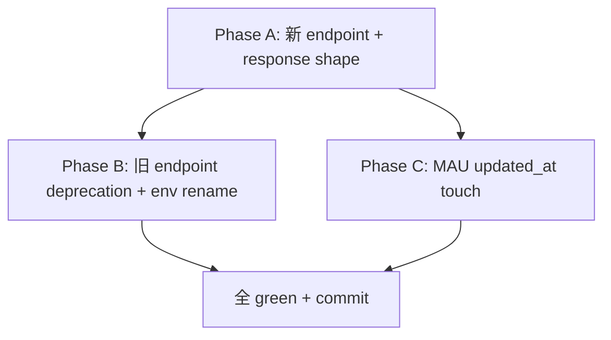

# _shared/service-info 変更計画書 (O48 ServiceHUB 2026-05-28 契約改訂への retrofit)

> **入力**: `./001_REVISE_SPEC.md`, `../../concept.md` §1.4 / §4.3, Step 2 で読んだ既存実装
> **最終更新**: 2026-05-28

---

## 1. 既存ファイル変更一覧

| ファイル | 変更内容 | リスク | 関連 SPEC § |
|---|---|---|---|
| `api/service-info.ts` | → `api/hub/service-info.ts` へ **rename + move** (path 変更で Vercel routing が `/api/hub/service-info` に変わる)。env 名 `SERVICE_INFO_TOKEN` → `HUB_SERVICE_INFO_SECRET`。default export ハンドラのみ維持 | Vercel routing 確認必要 (`vercel.json` の rewrites は `/api/` を除外しているため新 path も自動 routing OK) | §2.2 |
| (新規) `api/service-info.ts` | **deprecation stub** に置換: 全 method で 410 Gone + `{error:"deprecated", moved_to:"/api/hub/service-info"}` を返すだけ | 既存テスト (`service-info.test.ts`) は新 endpoint 用に書き換え | §7.2 旧 URL 廃止 |
| `src/services/serviceInfo/handler.ts` | コメント更新 (`SERVICE_INFO_TOKEN` → `HUB_SERVICE_INFO_SECRET`、path → `/api/hub/service-info`)。インターフェース・ロジックは無変更 (依存注入のため env 名直接記載なし) | 低 (実質コメントのみ) | §7.5 |
| `src/services/serviceInfo/collectMetrics.ts` | **大規模変更**: `ServiceInfo` interface を新契約 `ServiceInfoResponse` (schemaVersion + metrics[] + extra) へ。`collectMetrics` 実装で MAU + users_total + error_count_24h を `metrics[]` に格納、`generated_at` を `extra` へ移動。MAU 算出 SQL 追加 (`count(DISTINCT id) WHERE updated_at > now() - interval '30 days'`) | 中。response shape 変更で既存 unit test 全更新 | §2.2, §7.3 |
| `src/services/serviceInfo/index.ts` | 新 interface (`ServiceInfoResponse`) を export | 低 | §2.2 |
| `.env.example` | `SERVICE_INFO_TOKEN=...` 行を `HUB_SERVICE_INFO_SECRET=change-me-shared-secret` に rename + コメント更新 | 低 | §2.2 |
| `.env.local` | 既存 `SERVICE_INFO_TOKEN=<value>` 行を `HUB_SERVICE_INFO_SECRET=<value>` に rename (value は同じ秘密を流用 or 新規生成) | 低 (gitignored) | §2.2 |
| `api/service-info.test.ts` | → `api/hub/service-info.test.ts` へ rename + 新 endpoint/response 期待値に更新 | 中 | §3 テスト |
| `src/services/serviceInfo/handler.test.ts` | response 期待値を新 shape に更新、env 名のコメント変更 | 中 | §3 テスト |
| **(論点-001 案 A 採用時)** `api/_lib/handler.ts` or auth middleware | 認証通過時に `UPDATE users SET updated_at = now() WHERE id = $1` を実行する touch ロジック追加 | 中。全 API request に write が乗るが low-traffic 段階で許容 | §9 論点-001 |
| `docs/_shared/service-info/README.md` | 新契約サマリで更新 (endpoint/env/response 表) | 低 | - |

## 2. 新規ファイル一覧

| ファイル | 責務 | 依存 | LOC 見積 |
|---|---|---|---|
| `api/hub/service-info.ts` | rename 先 (実態は `api/service-info.ts` の移動) | 既存 src/services/serviceInfo | 既存 ~70 行を移動 |

## 3. 削除ファイル一覧

| ファイル | 削除理由 | 代替 |
|---|---|---|
| (なし) | rename で対応、新 path 配下に等価ファイルあり | - |

## 4. マイグレーション要否

- DB スキーマ変更: ❌ (既存 `users.updatedAt` 流用)
- 既存データ変換: ❌
- 設定ファイル変更: ✅ (`.env.example` の env 名変更、deploy-target env も rename 必要)
- ストレージパス変更: ❌

→ Phase 5 REVISE_MIGRATION 不要 (env rename は §6 ロールアウトで案内)。

## 5. 実装 Phase 分割 (`/flow:tdd-phase` 連携)

### Phase A: 新 endpoint + response shape (RED→GREEN→IMPROVE)
- 対象: `api/hub/service-info.ts` (新規 move)、`collectMetrics.ts` (新 shape)、`handler.ts` コメント、新テスト
- ゴール: 新 URL で新 response が green、`schemaVersion=1` + `metrics[]` + `extra.generated_at` がテストで担保

### Phase B: 旧 endpoint deprecation + env rename
- 対象: `api/service-info.ts` (410 stub)、`.env.example` + `.env.local` rename
- ゴール: 旧 URL が 410 Gone を返す、env 名が全置換

### Phase C: MAU updated_at touch (論点-001 採用時のみ)
- 対象: auth middleware に touch ロジック
- ゴール: 認証通過時に `updated_at` が更新される、MAU が「直近 30 日 active user」を反映する unit test green
- スキップ条件: 案 C (暫定 users_total = MAU 近似) 採用なら本 Phase 不要、案 A 採用で実装

## 6. 依存関係順序

## 7. ロールアウト計画

| ステップ | 内容 | 期日 | 検証方法 |
|---|---|---|---|
| 1 | Phase A-C 実装 + ローカル全テスト green | revise dispatch 直後 | `npm test` + grep で旧 signal 残存ゼロ |
| 2 | env rename: `.env.local` で `SERVICE_INFO_TOKEN` → `HUB_SERVICE_INFO_SECRET` | 実装後 | grep 残存ゼロ + ローカル dev で `/api/hub/service-info` が 200 |
| 3 | deploy-target env (Vercel) で `HUB_SERVICE_INFO_SECRET` を `vercel env add ... production` で設定 + 旧 `SERVICE_INFO_TOKEN` を `vercel env rm` | release Phase 1/3 | `vercel env ls production` |
| 4 | デプロイ (preview → prod) | release Phase 3 | `curl -H "Authorization: Bearer $SECRET" https://<url>/api/hub/service-info` が 200 + 新 response shape |
| 5 | HUB 側 admin で本サービス registry を新 URL (`https://<bousai-url>/api/hub/service-info`) に更新 | seiji 操作 | HUB ダッシュボードで本サービスが正常 pull される |

## 8. リスク・注意点

- HUB 側 admin が registry を更新するまで HUB は旧 URL を pull し続ける → 旧 URL stub の 410 Gone で気づきやすくする (ログでも確認可)
- `api/hub/service-info.ts` の serverless function 数: Vercel Hobby の 12 関数上限 (O49) を超えない確認必要。現状の関数数を別途確認 (cron 含めて 10+α 程度なら余裕)
- ESM import の拡張子問題 (O51): 既存実装で対処済、新ファイルでも `..` import 等 ERR_MODULE_NOT_FOUND 回避

## 9. 完了の定義 (DoD)

- [ ] Phase A-C 全完了 (Phase C は論点-001 採用時のみ)
- [ ] 単体テストカバレッジ目標達成 (既存目標継承)
- [ ] grep で旧 signal `SERVICE_INFO_TOKEN` / `/api/service-info` 残存ゼロ (ただし旧 `api/service-info.ts` の 410 stub 自体は残る = path のみ存在)
- [ ] `npm run build` green (ESM import 問題なし)
- [ ] AUDIT を新ルールで再実行し O48 drift 解消 (Critical/High ゼロ)
- [ ] release Phase 1-3 完了 (env rename + デプロイ + HUB registry 更新)

## 10. 更新履歴

| 日付 | 変更概要 | 実行者 |
|---|---|---|
| 2026-05-28 | 初版作成 | /flow:revise |
